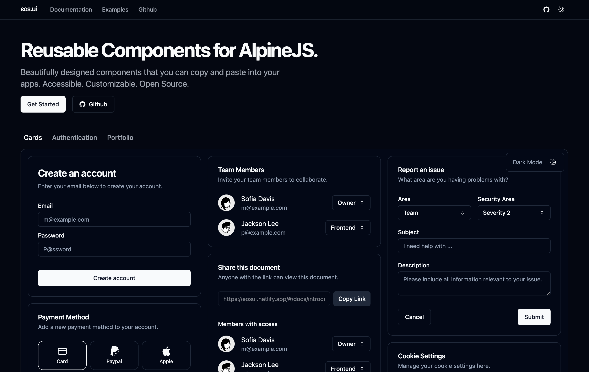

# eos.ui 
A re-usable, composable components for Alpine JS & HTML first applications.
 
 

 
## Overview

This repository is not your typical component library; instead, it's a curated collection of AlpineJS + TailwindCSS components designed for easy integration into both Client Side and Server Side JavaScript projects. The emphasis is on reusability, composability, and simplicity.

## Problem Statement

While there are existing solutions providing reusable AlpineJS components for copying and pasting, they often suffer from low reusability. This leads to repetitive copying and pasting of similar HTML templates across projects, reducing efficiency and maintainability.

## Solution

To tackle this issue, we leverage the `structr-composer` package, a lightweight non-JSX HTML templating library. This package empowers us to achieve high reusability, readability, and composability of the copied components. The components are implemented as straightforward JavaScript functions, generating HTML-escaped strings without the need for additional build steps required for JSX.

## Features

- **Reusability**: Components are designed for maximum reusability, reducing redundant code in your projects.
  
- **Composability**: The `structr-composer` package enables easy composition of components, providing flexibility in your application's structure.

- **HTML-First Approach**: All components generate HTML-escaped strings, making them compatible with both client-side and server-side JavaScript frameworks.

## Usage

1. Copy the desired component function from the repository.
2. Paste it into your project.
3. Call the function where you need the component, passing any required data.
4. Enjoy the simplicity and flexibility of reusable components in your Alpine JS and HTML-first applications!

## Contribution Guidelines

We welcome contributions that align with the project's goals of simplicity, reusability, and composability. If you have a new component to add or improvements to existing ones, feel free to submit a pull request.

## License

This project is licensed under the [MIT License](LICENSE), ensuring flexibility and openness for collaboration.

---

**Note:** This repository is not a standalone library but a collection of components designed to enhance your development experience with Alpine JS and TailwindCSS. Feel free to explore, contribute, and make your projects more efficient with these reusable components.
